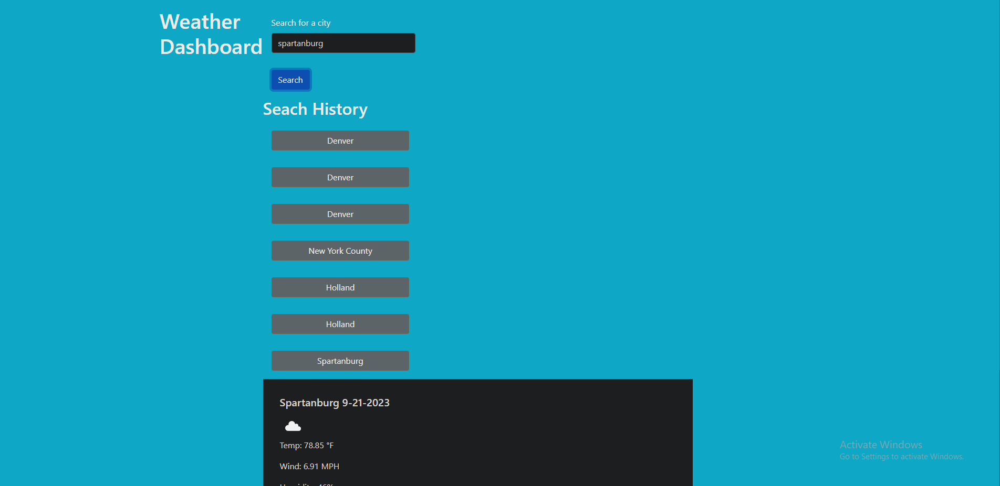

# Weather-Dashboard

## Table of Contents 

- [Description](#description)
- [Images](#description)
- [Link](#link)
- [Creator](#creator)

## Description

This project uses openweather api to make a call with the users in put to get both current weather as well as a 5 day forcast. This application also uses localstorage to save previous searches to be clicked again to view the forcast once more. 

## Images

## Link 

## Creator

- North Goddard (https://github.com/northgoddard)